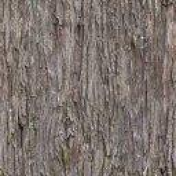
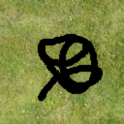
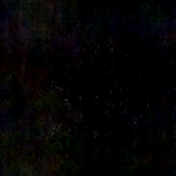
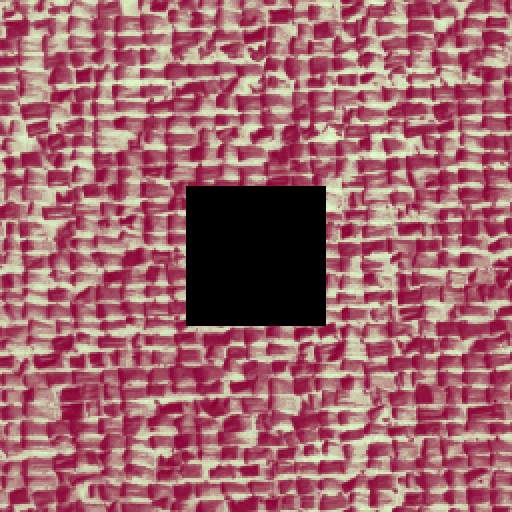
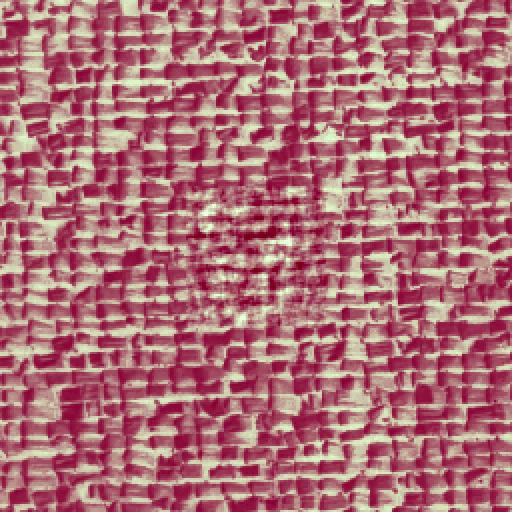
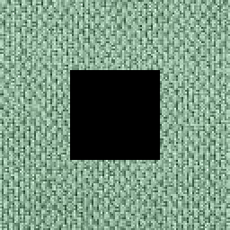
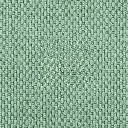

# Inpainting of Micro-Textures

## Overview
This project focuses on **micro-texture inpainting**, where missing parts of an image are reconstructed using stochastic modeling techniques. Micro-textures, which lack strong geometric patterns, can be effectively modeled as **Gaussian random fields**, enabling their synthesis through probabilistic methods.

The inpainting technique is based on the **Asymptotic Discrete Spot Noise (ADSN)** model. This model allows us to:
- Generate micro-textures from grayscale or color images.
- Condition the synthesis process to ensure continuity at the edges of masked regions.
- Achieve visually coherent and statistically consistent results.

---

## Objectives
1. **Grayscale Synthesis**: Create synthetic micro-textures using the ADSN model.
2. **Color Adaptation**: Extend the method to color images while preserving inter-channel correlations.
3. **Inpainting**: Reconstruct masked regions using available image data with smooth boundary transitions.
4. **Optimization**: Address computational challenges and improve scalability for larger images.

---

## Methodology

### **1. ADSN Model**

The ADSN model generates micro-textures by convolving a centered and normalized input image with white noise. The formula for a synthesized micro-texture $F$ is:

$$
F = \frac{1}{\sqrt{|\Omega|}} \cdot (u - \bar{u}) \ast W,
$$

#### **Results: Grayscale Synthesis**
Below are examples of grayscale micro-texture synthesis:

  <figure>
    
    <figcaption>Original Micro-Texture</figcaption>
  </figure>

  <figure>
    
    <figcaption>ADSN Grayscale Result</figcaption>
  </figure>

---

#### **Color Texture Adaptation**
For color images, $d = 3$, and the same Gaussian filter is applied across all channels to maintain inter-channel correlations.

#### **Results: Color Synthesis**
Below are examples of color micro-texture synthesis:

  <figure>
    
    <figcaption>Original Micro-Texture</figcaption>
  </figure>

  <figure>
    
    <figcaption>ADSN Grayscale Result</figcaption>
  </figure>

---

### **2. Conditioning with Kriging**

To ensure continuity at the edges of the mask, we apply **Kriging-based conditioning**. The projection of the Gaussian model $F$ onto the contour $C$ of the mask uses the formula:

$$
F^\ast(x) = \sum_{c \in C} \lambda_c(x) F(c),
$$

#### **Results: Kriging Conditioning**
The following images demonstrate the continuity achieved through Kriging-based conditioning:

  <figure>
    
    <figcaption>Masked Micro-texture</figcaption>
  </figure>

  <figure>
    
    <figcaption>Kriging component</figcaption>
  </figure>

---

### **3. Covariance Matrix Calculation**

The covariance matrix $\Gamma$ is derived from the auto-covariance function $c_v$ of the micro-texture:

$$
\Gamma((i, k), (j, l)) = c_v(j - i, l - k).
$$

---

## Results

### **Visual and Statistical Analysis**
- The inpainted images showed smooth transitions with no visible edges at the mask boundaries.
- The mean squared error (MSE) at the contour was in the order of $10^{-21}$, demonstrating excellent continuity.

#### **Examples of Inpainting**
Below are examples of the inpainting results on masked images:

  
  

  
  

---

## Implementation

### **Technologies Used**
- Python
- Libraries: `NumPy`, `scipy`, `Matplotlib`

---

Feel free to explore the code and results for further insights.
